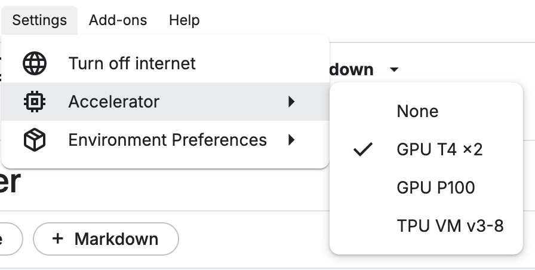
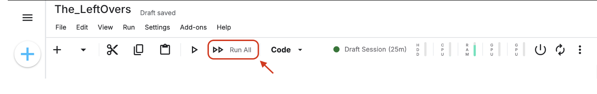
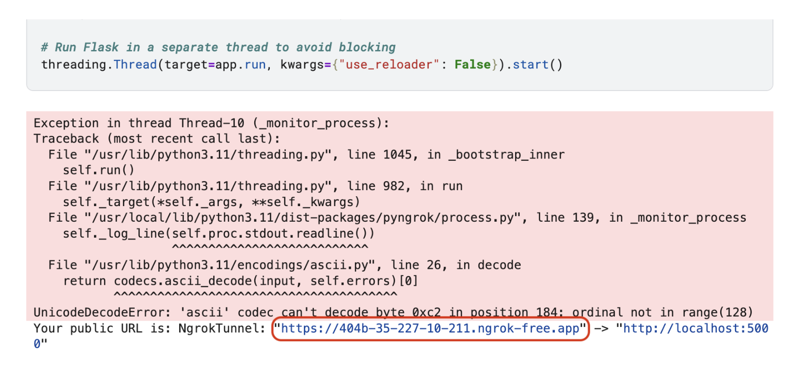

# LLM Server Setup Guide (Kaggle GPU)

This guide explains how to run the LLM server using a Jupyter Notebook on **Kaggle** with GPU acceleration. Please follow the steps below carefully.

---

## 📎 Notebook Link

Click the link below to open the notebook directly on Kaggle:

🔗 **[Open Kaggle Notebook](<https://www.kaggle.com/code/smammahdi/the-leftovers>)**

> Replace `<NOTEBOOK_LINK_HERE>` with the actual URL of your Kaggle Notebook.

---

## 🚀 Requirements

- A **Kaggle account**
- Access to **Kaggle Notebooks**
- GPU enabled in your Kaggle environment

---

## ✅ Steps to Run the LLM Server

### 1. Enable GPU

- Click the **"Settings"** tab (⚙️) on the right panel.
- Set the **Accelerator** to `GPU`.

> 

---

### 2. Click "Run All"

Click **"Run All"** at the top of the notebook to execute all cells.

> 

This will:
- Load the LLM on GPU
- Start a local server
- Launch **ngrok** to expose the server

> 

---

### 3. Copy the ngrok URL

Once the ngrok cell finishes running, copy the URL that looks like:

